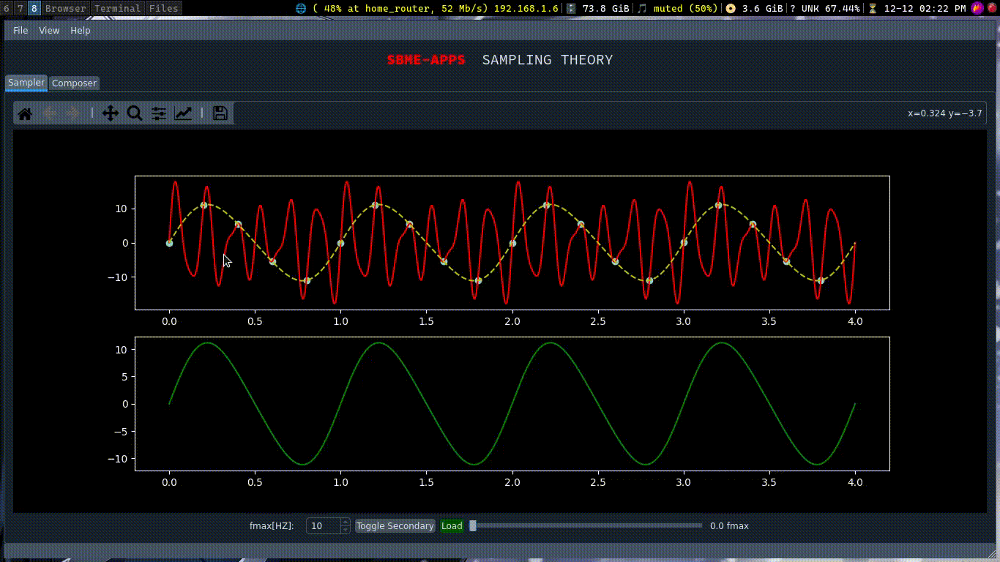
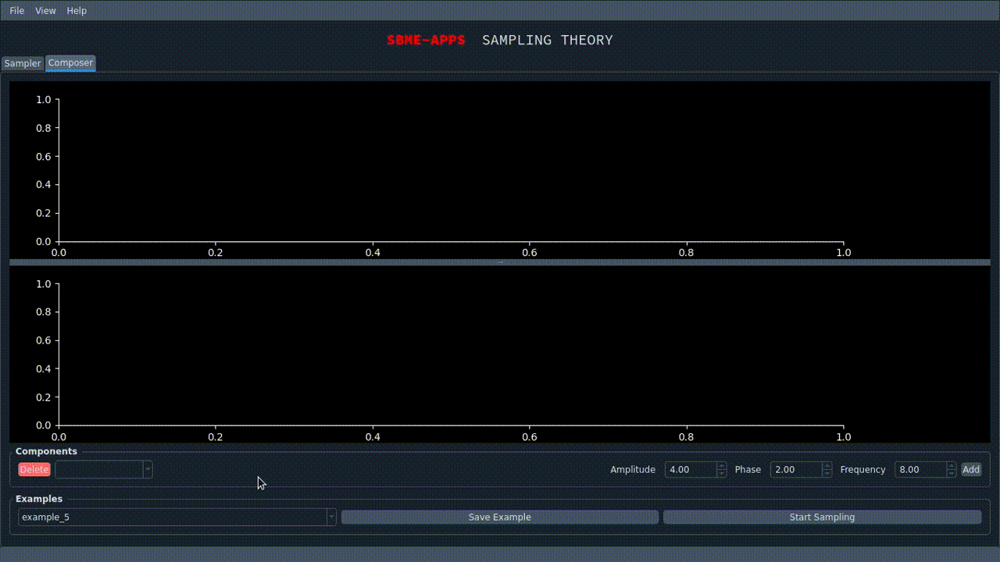

# Signal Reconstruction
- [Features](#features)
- [Demos](#demos)
    - [Reconstruction Demo](#reconstruction-demo)
    - [Composer Demo](#composer-demo)

## Features
- Signal synthizer from sinusoidals
- Signal reconstruction with different sampling rate (0-3) fmax
- Reconstruction for both synthesized signals or loaded one from files (csv only)
- Preloaded Examples for synthesized signals
- Adding new examples to the preloaded

## Demos

### Reconstruction Demo 

### Composer Demo

